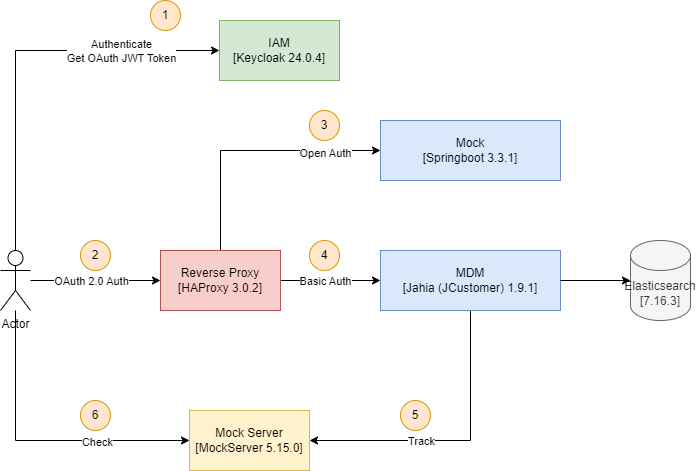
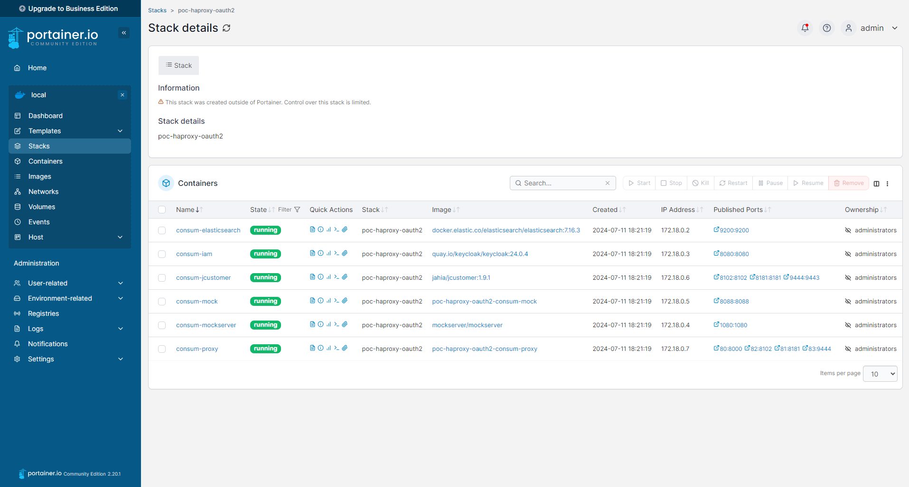
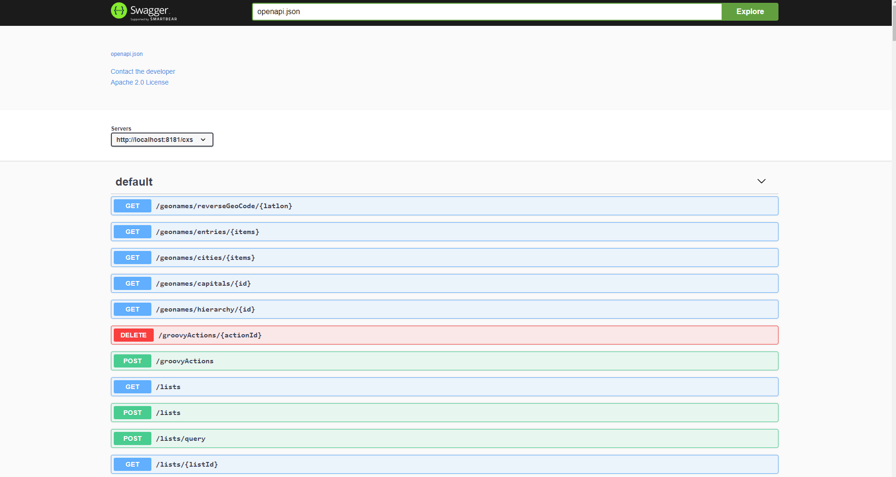

# Description

PoC to autenticate a mock service using OAuth 2

- **HAProxy**: Reverse proxy service version 3.0.2
- **Springboot**: Mock Springboot service version 3.3.1
- **Keycloak**: IAM service version 24.0.4
- **Jahia (jcustomer)**: MDM service version 1.9.1
- **Elasticsearch**: MDM Database service version 7.16.3
- **Elasticsearch Old**: MDM Database service version 7.4.2 (To check the snapshots exported)
- **MockServer**: MockServer service version 5.15.0

## Architecture Diagram



## Compile springboot mock service
```
$ ./mvnw clean install
```

## Create a network called consum for our stack
```
$ docker network create consum
```

## Compile services and start compose stack
```
$ docker compose up -d --no-deps --build
```



## Create two users to test
We must create manually two users accounts after keycloak start from Admin Portal UI. Access to Web Portal UI from:

```
http://localhost:8080
```

with credentials: admin/password

1. **Admin Account**
- Credentials: admin/password
- Email: admin@oferto.io
- Firstname: Admin
- Lastname: Actor
- Role: admin

2. **User Account**:
- Credentials: user/password
- Email: user@oferto.io
- Firstname: User
- Lastname: Actor
- Role: user

## Get a valid token

Get a valid token from Admin account:
```
$ curl --location 'http://localhost:8080/realms/mock/protocol/openid-connect/token' \
--header 'Content-Type: application/x-www-form-urlencoded' \
--data-urlencode 'grant_type=password' \
--data-urlencode 'client_id=mock' \
--data-urlencode 'username=admin' \
--data-urlencode 'password=password'
```

## Test Mock service

Test mock service authenticated from HAProxy using the previous issued token:

```
$ curl --location 'http://localhost' --header "Authorization: Bearer <YOUR_ACCESS_TOKEN>"
```

We can access directly to the mock service without any token
```
$ curl --location 'http://localhost:8088'

Hello Mock
```

## Test Jahia service

Test Jahia service authenticated from HAProxy using the previous issued token:

```
$ curl --location 'http://localhost:81/cxs/lists' --header "Authorization: Bearer <YOUR_ACCESS_TOKEN>"

{"list":[],"offset":0,"pageSize":50,"totalSize":0,"totalSizeRelation":"EQUAL","scrollIdentifier":null,"scrollTimeValidity":null}
```

Possible results:

- **Try mock request without any token**: Missing Authorization HTTP header
- **Try mock request with expired token**: JWT has expired
- **Try mock request with expired token not well formed**: Unsupported JWT signing algorithm
- **Try mock request with a valid token**: Hello Mock

## Jahia Open API UI

Open this link to access to Jahia Open API Web UI
```
http://localhost:8181/cxs/api-docs?url=openapi.json
```


## Para acceder al mock-server

```
http://localhost:1080/mockserver/dashboard
```

## Event Cluster Status API Test:

```
GET http://localhost:81/cxs/cluster
```

## Event Collection API Test:

```
POST http://localhost:81/cxs/profiles/search
```

with body:

```
{
    "offset": 0,
    "sortby": null,
    "forceRefresh": true,
    "condition": {
        "type": "codigoSocio",
        "parameterValues": {
            "string": "111111"
        }
    },
    "limit": 5,
    "text": null
}
```

with Authentication header:

```
Authentication: Bear <ACCESS_TOKEN>
```

## Stop and remove stack services from compose

```
$ docker compose down
```

## Snapshot for MDM Elastic

- The MDM Elastic service is prepared to make snapshots using a volume to externalize this snapshots 
and configuring ths service with the **path.repo** to this value **/usr/share/elasticsearch/backup**
folder where sabe the snapshots

## List MDM indices 

We can list all MDM indices to be exported using snapshots
```
GET http://localhost:9200/_cat/indices?v=true&s=index
```

## List MDM indices 

We can list all MDM indices to be exported using snapshots

```
GET http://localhost:9200/_cat/indices?v=true&s=index
```

## Create a snapshot repository

Create a snapshot repository releative to the **path.repo** folder:

We select the name **my-mdm_backup** for this snapshot repository localed inside the folder mdm_backup relative to the folder configured in **path.repo**:

```
PUT http://localhost:9201/_snapshot/my-mdm_backup
{
    "type": "fs",
    "settings": {
        "location": "mdm_backup"
    }
}
```

## Create a snapshot 

Create a snapshot inside this repository called **my-mdm_backup**

```
PUT http://localhost:9200/_snapshot/my-mdm_backup/my_snapshot_20240719162000
```

Now we have some MDM Elastic snaphosts created inside a volume to be shared later with other Elastic service where import someone.

## Links

- [jCustomer event checker in JCustomer 2.x][(https://hub.docker.com/r/sonatype/nexus3/](https://academy.jahia.com/documentation/jexperience/jexperience-2.x-and-3.x/system-administrator/upgrading-jcustomer/jcustomer-event-checker))
